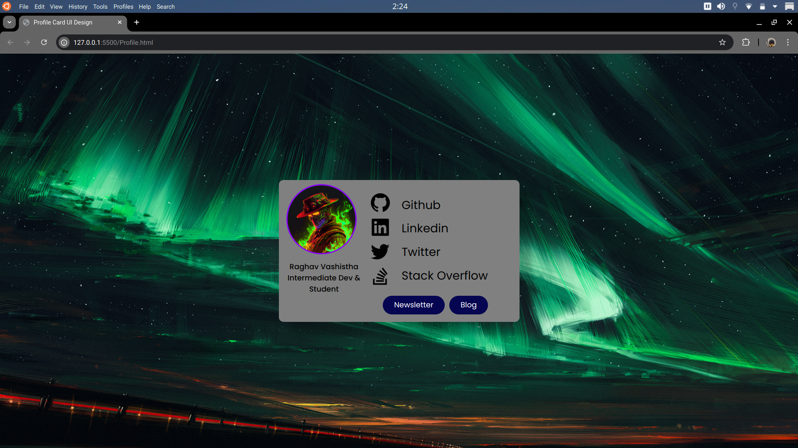
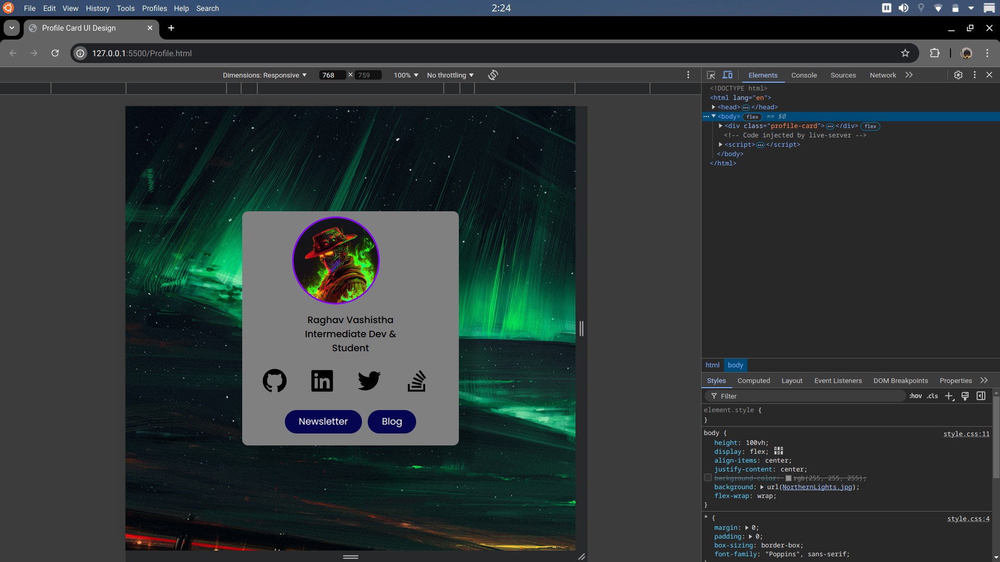
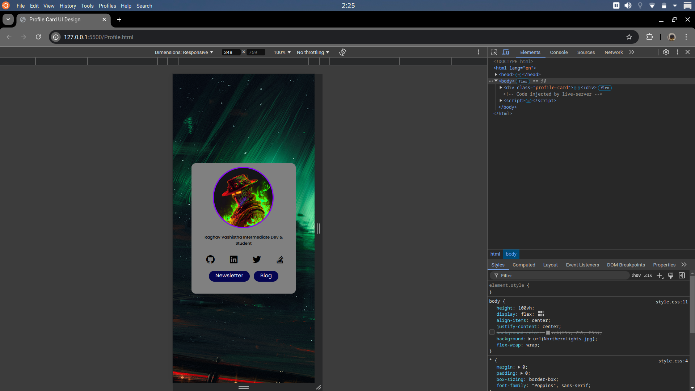

# Responsive-ProfileCard

### Why Create this ?
I created a Responsive Profile Card as I imagined that in future people will replace visitng cards with something like this which has links to all their Social Media handles and will be sharing links of their Profile Card to their acquaintances and clients. 

## Features 
- **Responsive-Nature**: If You want to share a Visiting Card to anyone it should be convenient for you to share it from any device and it should be visible from any device this card solves that basic problem

## Screenshots




## Technologies Used

- HTML
- CSS

## Installation

1. Clone the repository:
   ```bash
   git clone https://github.com/RaghavV8/Responsive-ProfileCard.git